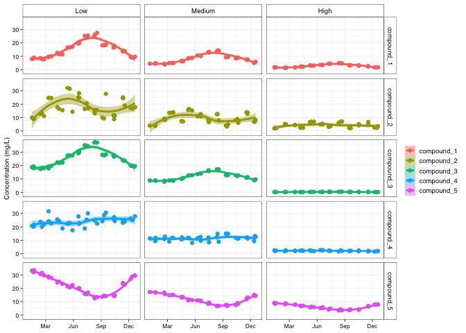

```r
source(here("functions", "theme_pepe.R"))
```

# Before we start -  The data

For this class we will use some mock data made to represent the typical outcomes of a standard sampling campaign

In this case we have several files:

- A file containing information about the sampling sites. There are a total of nine sites, distributed among three treatments (low, medium and high)
- A sample logbook, where all the information about the field-specific details for each collected samples are stored (e.g. date, time, who collected it)
- Four samples of analytical results for 5 compounds. These come as separate files, one for each batch of analysis carried out by our analytical laboratory


```r
sites <- read_csv(here("data", "sites.csv"))
```

```
## Parsed with column specification:
## cols(
##   site_id = col_character(),
##   altitude = col_double(),
##   latitude = col_double(),
##   longitude = col_double(),
##   treatment = col_character()
## )
```

```r
sample_logbook <- read_csv(here("data", "sample_logbook.csv"))
```

```
## Parsed with column specification:
## cols(
##   sample_id = col_character(),
##   site_id = col_character(),
##   day = col_double(),
##   month = col_double(),
##   year = col_double(),
##   hh = col_double(),
##   mm = col_double(),
##   collected_by = col_character()
## )
```

```r
batch_1 <- read_csv(here("data", "Batch_1.csv"))
```

```
## Parsed with column specification:
## cols(
##   sample_id = col_character(),
##   submission_date = col_date(format = ""),
##   analysis_date_time = col_character(),
##   compound_1 = col_double(),
##   compound_2 = col_double(),
##   compound_3 = col_double(),
##   compound_4 = col_double(),
##   compound_5 = col_double()
## )
```

```r
batch_2 <- read_csv(here("data", "Batch_2.csv"))
```

```
## Parsed with column specification:
## cols(
##   sample_id = col_character(),
##   submission_date = col_date(format = ""),
##   analysis_date_time = col_character(),
##   compound_1 = col_double(),
##   compound_2 = col_double(),
##   compound_3 = col_double(),
##   compound_4 = col_double(),
##   compound_5 = col_double()
## )
```

```r
batch_3 <- read_csv(here("data", "Batch_3.csv"))
```

```
## Parsed with column specification:
## cols(
##   sample_id = col_character(),
##   submission_date = col_date(format = ""),
##   analysis_date_time = col_character(),
##   compound_1 = col_double(),
##   compound_2 = col_double(),
##   compound_3 = col_double(),
##   compound_4 = col_double(),
##   compound_5 = col_double()
## )
```

```r
batch_4 <- read_csv(here("data", "Batch_4.csv"))
```

```
## Parsed with column specification:
## cols(
##   sample_id = col_character(),
##   submission_date = col_date(format = ""),
##   analysis_date_time = col_character(),
##   compound_1 = col_double(),
##   compound_2 = col_double(),
##   compound_3 = col_double(),
##   compound_4 = col_double(),
##   compound_5 = col_double()
## )
```

# Working with dates

## R basic data types for dates and times

### Dates

Base r as the `as.Date()` function to format data into a date format.

If it is in nice ISO format (year/month/day) everything works alright


```r
as.Date("2018/03/23")
```

```
## [1] "2018-03-23"
```
But what if the data is in any other "shape" (e.g. day/month/year)


```r
as.Date("23/03/2018")
```

```
## [1] "0023-03-20"
```

That dosnt quite work. You can specify what format it is in.


```r
as.Date("23/03/2018", format='%d/%m/%Y')
```

```
## [1] "2018-03-23"
```

### dates and times

But what if we need date AND time. R has two specific formats for that:

 - `POSIXct`: Stores seconds since UNIX epoch (00:00:00 UTC on 1 January 1970),
 - `POSIXlt`: Stores a list of day, month, year, hour, minute, second, etc.
 
The most common one is `POSIXct`. You can use `as.POSIXct()` to turn a string into a date-time object. You still have to specify what format it comes in.
 

```r
as.POSIXct("080406 10:11", format = "%y%m%d %H:%M")
```

```
## [1] "2008-04-06 10:11:00 CDT"
```

fortunately, the **Tidyverse** has nice tools to help us handle dates.


## Dates and times with {lubridate}


```r
ymd("2018-march-23") 
```

```
## [1] "2018-03-23"
```


```r
dmy_hm("23-03-2018 15:32")
```

```
## [1] "2018-03-23 15:32:00 UTC"
```


### Math with dates - Issues

Modified from the [lubridate cheat sheet](https://github.com/rstudio/cheatsheets/blob/master/lubridate.pdf)


```r
nor <- ymd_hms("2018-01-01 01:30:00",tz="Canada/Central")
gap <- ymd_hms("2018-03-11 01:30:00",tz="Canada/Central") # spring forward
lap <- ymd_hms("2018-11-04 00:30:00",tz="Canada/Central") # fall back

leap <- ymd("2019-03-01") #leap year
```


**Periods** track changes in clock times, which ignore time line irregularities. **Keep this in mind, be careful**


```r
nor + minutes(90)
```

```
## [1] "2018-01-01 03:00:00 CST"
```

```r
gap + minutes(90)
```

```
## [1] "2018-03-11 03:00:00 CDT"
```

```r
lap + minutes(90)
```

```
## [1] "2018-11-04 02:00:00 CST"
```

```r
leap + years(1)
```

```
## [1] "2020-03-01"
```

You can *solve* this *problem* by uding **durations** instead of **periods**


```r
nor + dminutes(90)
```

```
## [1] "2018-01-01 03:00:00 CST"
```

```r
gap + dminutes(90)
```

```
## [1] "2018-03-11 04:00:00 CDT"
```

```r
lap + dminutes(90)
```

```
## [1] "2018-11-04 01:00:00 CST"
```

```r
leap + dyears(1)
```

```
## [1] "2020-02-29 06:00:00 UTC"
```


## Lets prep our data files

Let's start with the sample logbok, here the days, month year, hours and minutes are in their own separate figures. We need to concatenate them and then make them into a date_time.


```r
sample_logbook <- sample_logbook %>% 
  mutate(sampling_date = str_c(year, month, day, sep = "/")) %>%                 # this concatenates year, month and day with a "/" in between
  mutate(sampling_time = str_c(hh, mm, sep = ":")) %>%                           # this concatenates hours and minutes  with a ":" in between
  mutate(samp_date_time = str_c(sampling_date, sampling_time, sep = " ")) %>%    # this concatenates the date and the time with a space in between
  mutate(samp_date_time = ymd_hm(samp_date_time, tz = "Canada/Central")) %>%     # this is where we turn that character string into a date-time
  mutate(sampling_date = ymd(sampling_date)) %>%                                 # we make the date alone into a date, in case we need it later
  mutate(sampling_time = hm(sampling_time))                                      # we make the time alone into a time, in case we need it later

print(sample_logbook)
```

```
## # A tibble: 108 x 11
##    sample_id site_id   day month  year    hh    mm collected_by sampling_date
##    <chr>     <chr>   <dbl> <dbl> <dbl> <dbl> <dbl> <chr>        <date>       
##  1 TR_001    site_a     21     1  2018    13    39 JS           2018-01-21   
##  2 TR_002    site_b     14     1  2018    10    32 JLR          2018-01-14   
##  3 TR_003    site_c     19     1  2018    17    24 JS           2018-01-19   
##  4 TR_004    site_d      1     1  2018    11    22 JS           2018-01-01   
##  5 TR_005    site_e     20     1  2018    14    34 TB           2018-01-20   
##  6 TR_006    site_f     19     1  2018    10    23 TB           2018-01-19   
##  7 TR_007    site_g     12     1  2018    13    32 JS           2018-01-12   
##  8 TR_008    site_h     10     1  2018    13    32 JLR          2018-01-10   
##  9 TR_009    site_i     16     1  2018    11    24 JS           2018-01-16   
## 10 TR_010    site_a     16     2  2018    12    32 TB           2018-02-16   
## # … with 98 more rows, and 2 more variables: sampling_time <Period>,
## #   samp_date_time <dttm>
```

We will work with the chemistry data later, as it is easier to deal with once we have combined the different batches into one.


## filtering dates


Imagine we come back from the field and realize that one of or pieces of field equipment was giving us erroneous data for some time and we didn't notice. Now we want to exclude the samples collected during that period.

first we need to create the interval of time we want to exclude


```r
equipment_malfunction <- interval(ymd_hm("2018/02/15 15:30"), ymd_hm("2018/03/20 17:45"))

print(equipment_malfunction)
```

```
## [1] 2018-02-15 15:30:00 UTC--2018-03-20 17:45:00 UTC
```

Lets take a look to see how many samples we are talking about


```r
sample_logbook %>% 
  filter(sampling_date %within% equipment_malfunction)
```

```
## # A tibble: 16 x 11
##    sample_id site_id   day month  year    hh    mm collected_by sampling_date
##    <chr>     <chr>   <dbl> <dbl> <dbl> <dbl> <dbl> <chr>        <date>       
##  1 TR_010    site_a     16     2  2018    12    32 TB           2018-02-16   
##  2 TR_011    site_b     23     2  2018     9    23 TB           2018-02-23   
##  3 TR_013    site_d     18     2  2018    10    25 JS           2018-02-18   
##  4 TR_014    site_e     20     2  2018    11    33 JS           2018-02-20   
##  5 TR_015    site_f     18     2  2018     7    29 JS           2018-02-18   
##  6 TR_017    site_h     18     2  2018    10    28 JLR          2018-02-18   
##  7 TR_018    site_i     16     2  2018     9    29 TB           2018-02-16   
##  8 TR_019    site_a     10     3  2018    13    30 JS           2018-03-10   
##  9 TR_020    site_b     10     3  2018    11    31 TB           2018-03-10   
## 10 TR_021    site_c     19     3  2018    14    37 TB           2018-03-19   
## 11 TR_022    site_d     20     3  2018    11    34 TB           2018-03-20   
## 12 TR_023    site_e      6     3  2018    14    32 JLR          2018-03-06   
## 13 TR_024    site_f     16     3  2018     9    29 JLR          2018-03-16   
## 14 TR_025    site_g     20     3  2018     9    32 TB           2018-03-20   
## 15 TR_026    site_h     20     3  2018    12    30 JS           2018-03-20   
## 16 TR_027    site_i     19     3  2018    13    30 JLR          2018-03-19   
## # … with 2 more variables: sampling_time <Period>, samp_date_time <dttm>
```

Now we filter out this interval


```r
sample_logbook %>% 
  filter(!sampling_date %within% equipment_malfunction)  # the "!" implies that we want to select the OPOSITE
```

```
## # A tibble: 92 x 11
##    sample_id site_id   day month  year    hh    mm collected_by sampling_date
##    <chr>     <chr>   <dbl> <dbl> <dbl> <dbl> <dbl> <chr>        <date>       
##  1 TR_001    site_a     21     1  2018    13    39 JS           2018-01-21   
##  2 TR_002    site_b     14     1  2018    10    32 JLR          2018-01-14   
##  3 TR_003    site_c     19     1  2018    17    24 JS           2018-01-19   
##  4 TR_004    site_d      1     1  2018    11    22 JS           2018-01-01   
##  5 TR_005    site_e     20     1  2018    14    34 TB           2018-01-20   
##  6 TR_006    site_f     19     1  2018    10    23 TB           2018-01-19   
##  7 TR_007    site_g     12     1  2018    13    32 JS           2018-01-12   
##  8 TR_008    site_h     10     1  2018    13    32 JLR          2018-01-10   
##  9 TR_009    site_i     16     1  2018    11    24 JS           2018-01-16   
## 10 TR_012    site_c     11     2  2018    12    34 JS           2018-02-11   
## # … with 82 more rows, and 2 more variables: sampling_time <Period>,
## #   samp_date_time <dttm>
```
# simplyfiying timstamps


```r
ymd_hm("2019-05-25 18:23") %>% 
  date()
```

```
## [1] "2019-05-25"
```


### One more thing...


```r
Sys.Date()
```

```
## [1] "2020-11-04"
```

```r
Sys.time()
```

```
## [1] "2020-11-04 12:38:31 CST"
```
 

```r
str_c("This report was created on", Sys.time(), sep = " ")
```

```
## [1] "This report was created on 2020-11-04 12:38:31"
```


# Data wrangling - binding and joining tables

First thing, we want to take the 4 batches of analytical results we got from the lab and bind them into one single *results* table


```r
bind_rows(batch_1, batch_2, batch_3, batch_4)
```

```
## # A tibble: 108 x 8
##    sample_id submission_date analysis_date_t… compound_1 compound_2 compound_3
##    <chr>     <date>          <chr>                 <dbl>      <dbl>      <dbl>
##  1 TR_001    2018-01-27      30/3/2018 15:30        8.90       9.24     18.2  
##  2 TR_002    2018-01-27      30/3/2018 15:30        7.98      10.0      18.7  
##  3 TR_003    2018-01-27      30/3/2018 15:30        8.66       8.92     19.3  
##  4 TR_004    2018-01-27      30/3/2018 15:30        4.52       4.01      8.88 
##  5 TR_005    2018-01-27      30/3/2018 15:30        4.84       4.18      8.59 
##  6 TR_006    2018-01-27      30/3/2018 15:30        4.45       3.69      8.97 
##  7 TR_007    2018-01-27      30/3/2018 15:30        1.54       2.18      0.217
##  8 TR_008    2018-01-27      30/3/2018 15:30        1.65       2.02      0.216
##  9 TR_009    2018-01-27      30/3/2018 15:30        1.59       2.08      0.218
## 10 TR_010    2018-02-27      30/3/2018 15:30        7.83      13.4      18.3  
## # … with 98 more rows, and 2 more variables: compound_4 <dbl>, compound_5 <dbl>
```

if you want to keep track of which file each data point came from, you can tell `bind_rows()` to create a new column with `.id = "comun_name`.

If you provide the dataframes as a list, it will use that info to populate that column. Make sure to use `tibble::lst()` instead of `base::list()` to ensure that the names of the dataframes are stored in the list


```r
results <- bind_rows(lst(batch_1, batch_2, batch_3, batch_4), 
                     .id = "batch")

print(results)
```

```
## # A tibble: 108 x 9
##    batch sample_id submission_date analysis_date_t… compound_1 compound_2
##    <chr> <chr>     <date>          <chr>                 <dbl>      <dbl>
##  1 batc… TR_001    2018-01-27      30/3/2018 15:30        8.90       9.24
##  2 batc… TR_002    2018-01-27      30/3/2018 15:30        7.98      10.0 
##  3 batc… TR_003    2018-01-27      30/3/2018 15:30        8.66       8.92
##  4 batc… TR_004    2018-01-27      30/3/2018 15:30        4.52       4.01
##  5 batc… TR_005    2018-01-27      30/3/2018 15:30        4.84       4.18
##  6 batc… TR_006    2018-01-27      30/3/2018 15:30        4.45       3.69
##  7 batc… TR_007    2018-01-27      30/3/2018 15:30        1.54       2.18
##  8 batc… TR_008    2018-01-27      30/3/2018 15:30        1.65       2.02
##  9 batc… TR_009    2018-01-27      30/3/2018 15:30        1.59       2.08
## 10 batc… TR_010    2018-02-27      30/3/2018 15:30        7.83      13.4 
## # … with 98 more rows, and 3 more variables: compound_3 <dbl>,
## #   compound_4 <dbl>, compound_5 <dbl>
```

Now that we have all the chemical data in one single onject, lets put **Sites**, **Sample logbook**, and **Results** all toguether. 


```r
combined_data <- left_join(sample_logbook, sites, by = "site_id") %>% 
  left_join(results, by = "sample_id")
  
print(combined_data)
```

```
## # A tibble: 108 x 23
##    sample_id site_id   day month  year    hh    mm collected_by sampling_date
##    <chr>     <chr>   <dbl> <dbl> <dbl> <dbl> <dbl> <chr>        <date>       
##  1 TR_001    site_a     21     1  2018    13    39 JS           2018-01-21   
##  2 TR_002    site_b     14     1  2018    10    32 JLR          2018-01-14   
##  3 TR_003    site_c     19     1  2018    17    24 JS           2018-01-19   
##  4 TR_004    site_d      1     1  2018    11    22 JS           2018-01-01   
##  5 TR_005    site_e     20     1  2018    14    34 TB           2018-01-20   
##  6 TR_006    site_f     19     1  2018    10    23 TB           2018-01-19   
##  7 TR_007    site_g     12     1  2018    13    32 JS           2018-01-12   
##  8 TR_008    site_h     10     1  2018    13    32 JLR          2018-01-10   
##  9 TR_009    site_i     16     1  2018    11    24 JS           2018-01-16   
## 10 TR_010    site_a     16     2  2018    12    32 TB           2018-02-16   
## # … with 98 more rows, and 14 more variables: sampling_time <Period>,
## #   samp_date_time <dttm>, altitude <dbl>, latitude <dbl>, longitude <dbl>,
## #   treatment <chr>, batch <chr>, submission_date <date>,
## #   analysis_date_time <chr>, compound_1 <dbl>, compound_2 <dbl>,
## #   compound_3 <dbl>, compound_4 <dbl>, compound_5 <dbl>
```


```r
combined_data_long <- combined_data %>% 
 pivot_longer(cols = c(compound_1, compound_2, compound_3, compound_4, compound_5), 
               names_to = "compound", 
               values_to = "concentration") %>% 
  mutate(treatment = factor(treatment, levels = c("Low", "Medium", "High")))

print(combined_data_long)
```

```
## # A tibble: 540 x 20
##    sample_id site_id   day month  year    hh    mm collected_by sampling_date
##    <chr>     <chr>   <dbl> <dbl> <dbl> <dbl> <dbl> <chr>        <date>       
##  1 TR_001    site_a     21     1  2018    13    39 JS           2018-01-21   
##  2 TR_001    site_a     21     1  2018    13    39 JS           2018-01-21   
##  3 TR_001    site_a     21     1  2018    13    39 JS           2018-01-21   
##  4 TR_001    site_a     21     1  2018    13    39 JS           2018-01-21   
##  5 TR_001    site_a     21     1  2018    13    39 JS           2018-01-21   
##  6 TR_002    site_b     14     1  2018    10    32 JLR          2018-01-14   
##  7 TR_002    site_b     14     1  2018    10    32 JLR          2018-01-14   
##  8 TR_002    site_b     14     1  2018    10    32 JLR          2018-01-14   
##  9 TR_002    site_b     14     1  2018    10    32 JLR          2018-01-14   
## 10 TR_002    site_b     14     1  2018    10    32 JLR          2018-01-14   
## # … with 530 more rows, and 11 more variables: sampling_time <Period>,
## #   samp_date_time <dttm>, altitude <dbl>, latitude <dbl>, longitude <dbl>,
## #   treatment <fct>, batch <chr>, submission_date <date>,
## #   analysis_date_time <chr>, compound <chr>, concentration <dbl>
```


```r
combined_data_long %>% 
ggplot() +
  
  facet_grid(rows = vars(compound), cols = vars(treatment)) + # similar to facet_wrap() but you can provide   two variables (to make a grid). You need to reference the variables using vars(). Annoying!
  
  geom_point(aes(x = samp_date_time, y = concentration, colour = compound)) +
  geom_smooth(aes(x = samp_date_time, y = concentration, colour = compound, fill = compound)) +
  scale_x_datetime(date_breaks  = "3 months", date_labels = "%b") +
  theme_pepe() +
  labs(x = NULL,
       y = "Concentration (mg/L)")
```

```
## `geom_smooth()` using method = 'loess' and formula 'y ~ x'
```

<!-- -->


